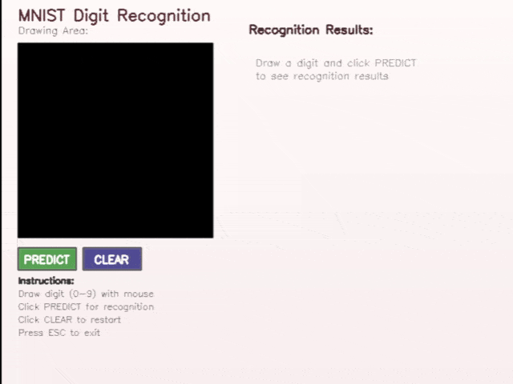

# Neural Network for MNIST Handwritten Digit Recognition

A C++ implementation of a Multi-Layer Perceptron (MLP) for recognizing handwritten digits using the MNIST dataset.

## 🚀 Building the Project

### Build Scripts

The project uses a single build script `scripts/build.bat` with the following options:

- `build.bat` - Builds Release configuration (default)
- `build.bat debug` - Builds Debug configuration
- `build.bat release` - Builds Release configuration explicitly
- `build.bat all` - Builds both Debug and Release configurations

### Performance Note
- Release mode is recommended for training (5-10x faster)
- Debug mode training could take several hours
- Drawing application works fine in either mode

## 🎯 Demo



*Interactive drawing application with real-time digit recognition*

## 🏆 Performance Results

**Achieved Accuracy: 96.48%** on test set (10,000 samples)

### Per-Digit Accuracy Breakdown:
| Digit | Accuracy | Correct/Total |
|-------|----------|---------------|
| 0     | 98.37%   | 964/980       |
| 1     | 98.59%   | 1119/1135     |
| 2     | 95.54%   | 986/1032      |
| 3     | 96.34%   | 973/1010      |
| 4     | 96.44%   | 947/982       |
| 5     | 94.73%   | 845/892       |
| 6     | 96.35%   | 923/958       |
| 7     | 96.69%   | 994/1028      |
| 8     | 96.10%   | 936/974       |
| 9     | 95.24%   | 961/1009      |

## 🧠 Network Architecture

- **Input Layer**: 784 neurons (28×28 pixel images)
- **Hidden Layer 1**: 128 neurons
- **Hidden Layer 2**: 64 neurons  
- **Output Layer**: 10 neurons (digits 0-9)
- **Activation Function**: Sigmoid
- **Learning Rate**: 0.01
- **Training Epochs**: 100

## 🔬 Training Algorithm

### Backpropagation with Gradient Descent

1. **Forward Pass**: Compute the outputs of the network for a given input
2. **Compute Error**: Compare network output with expected output using loss function
3. **Backward Pass (Backpropagation)**: Compute gradients of loss with respect to weights and biases
4. **Update Weights**: Adjust weights and biases using gradient descent

### Early Stopping
- **Dataset Split**: 80% training, 20% validation
- **Metric**: Validation accuracy (not training error)
- **Patience**: 5 epochs
- **Minimal Improvement**: 0.1% increase in validation accuracy
- **Maximum Epochs**: 100 (may stop earlier due to early stopping)

The training will automatically stop when the validation accuracy shows no improvement of at least 0.1% for 10 consecutive epochs, or when reaching 100 epochs, whichever comes first. This helps prevent overfitting and ensures the model generalizes well to new data.

## 📁 Project Components

- **MNIST Training (`MNIST/`)**:
    - Purpose: Handles the training and evaluation of neural network models using the MNIST dataset.
    - Key files: `MNIST/src/main.cpp` is the main entry point for training-related tasks. Model configurations and outputs are typically stored in `MNIST/models/`.

- **Interactive Prediction (`draw_and_predict/`)**:
    - Purpose: An SFML-based graphical application that allows users to draw a digit with the mouse and have a pre-trained model predict the digit.
    - Key files: `draw_and_predict/src/main.cpp` contains the logic for the interactive drawing and prediction interface.

- **MLP Library (`mlp/`)**:
    - Purpose: A foundational library providing the implementation of a Multi-Layer Perceptron. This includes the core neural network structures like perceptrons, layers, and the backpropagation algorithm.
    - Key files: Key interface is `mlp/include/mlp.h` and its implementation `mlp/src/mlp.cpp`. The basic building block, the perceptron, is defined in `mlp/include/perceptron.h`.

## 🚀 Getting Started

### Build the Project

The project uses Premake5 for build configuration.

#### Option 1: Using Premake5 directly
```bash
premake5 vs2022
msbuild MultiLayerPerception.sln /p:Configuration=Debug /p:Platform=x64
```

#### Option 2: Using build script (Windows)
```bash
scripts/build.bat
```

### ⚠️ Performance Note

This neural network runs entirely on CPU, which means training can be quite slow. For optimal performance:
- Build and run training in **Release** mode, which is significantly faster than Debug mode

### Train a New Model
1. Uncomment `train();` in `MNIST/src/main.cpp`
2. Build and run the MNIST project

### Evaluate Pre-trained Model
```bash
cd bin/Debug/MNIST
./MNIST.exe
```

### Use Interactive Drawing Application

The `draw_and_predict` application provides a GUI for drawing digits and getting real-time predictions.

#### Prerequisites
- Ensure you have a trained model in the `models/` directory
- OpenCV must be properly installed and configured

#### Compile and Run
```bash
# Navigate to the drawing application directory
cd draw_and_predict

# Compile the application
make

# Run the application
./draw_and_predict
```

#### How to Use
1. **Draw**: Use your mouse to draw a digit (0-9) in the drawing area
2. **Predict**: Click the "PREDICT" button to recognize the drawn digit
3. **Clear**: Click the "CLEAR" button to clear the canvas and start over
4. **Exit**: Press ESC key or click the X button to close the application

#### Features
- **Real-time drawing** with smooth brush strokes
- **Instant recognition** results with confidence scores
- **Probability bars** showing likelihood for each digit (0-9)
- **Professional GUI** with intuitive controls

## 📊 Dataset

The MNIST dataset is split into three sets:

**Total Dataset**: 70,000 images
- **Training Set**: 48,000 images (80% of original training data)
- **Validation Set**: 12,000 images (20% of original training data)
- **Test Set**: 10,000 images (separate test set)

Data source: [MNIST in CSV format](https://pjreddie.com/projects/mnist-in-csv/)

The original `mnist_train.csv` (60,000 images) is split 80/20 into training and validation sets during the training process. The `mnist_test.csv` (10,000 images) is kept completely separate and only used for final model evaluation.

## 🛠️ Dependencies

- [OpenCV](https://github.com/opencv/opencv) 4.11.0 - Computer vision library
- [SFML](https://www.sfml-dev.org/) 3.0.0 - Simple and Fast Multimedia Library (for interactive drawing app)
- Visual Studio 2019/2022 - C++ compiler
- Premake5 - Build system generator

## 📁 Project Structure

```
NN/
├── mlp/                    # Core neural network library
├── MNIST/                  # MNIST training & evaluation
├── draw_and_predict/       # Interactive digit drawing app
├── scripts/                # Build scripts
└── README.md
```

## 🚀 Future Improvements

### 🧠 Neural Network Enhancements
- **Convolutional Neural Networks (CNN)**: Implement convolutional layers for better spatial feature extraction
- **Alternative Activation Functions**:
  - ReLU and variants (Leaky ReLU,)
- **Regularization Techniques**:
  - Dropout layers to prevent overfitting
  - Batch normalization for stable training
  - L1/L2 weight regularization